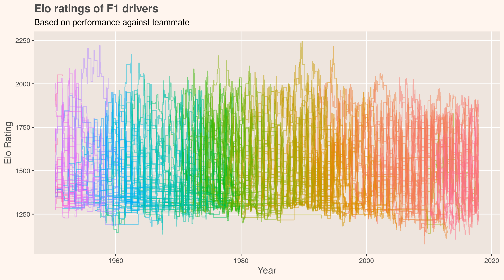

# Applying Elo ratings to Formula one

`F1_Elo.R`: script calculates Elo ratings for each drivers' performance against their teammate

### Top drivers ranked by their best five years
Position | Elo Rating | Driver
------------ | ------------ |-------------
1 | 2044 | Fangio            
2 | 1992 | Prost             
3 | 1992 | Fagioli           
4 | 1979 | Senna             
5 | 1960 | Schumacher
6 | 1898 | Farina            
7 | 1866 | Hill              
8 | 1865 | Clark             
9 | 1860 | Lauda             
10 | 1857 | Hamilton

### Annual distribution of Elo ratings
Reveals potential differences in (apparent) skill across the field. Some years are more uniform and others bimodal.

